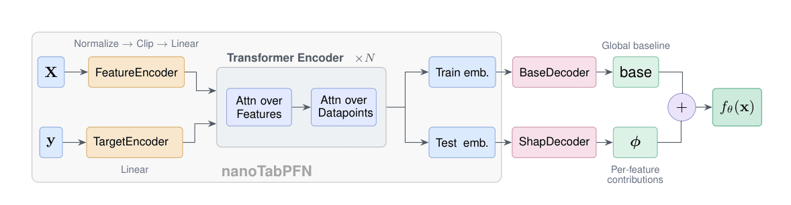

# ShapPFN

This repository contains the code for the ShapPFN model described in [Real-Time Explanations for Tabular Foundation Models]. At a high level, ShapPFN combines:
- PFN-style tabular transformers (TabPFN / nanoTabPFN-like alternating attention over rows and features)
- An explicit additive decomposition (`base` + per-feature contributions) via separate decoder heads
- ViaSHAP-style *Shapley value regression* training, so explanations are part of the model output (not a post-hoc procedure)




As reported in the paper, this approach can match KernelSHAP closely (e.g. R²≈0.96 and cosine≈0.99 on their benchmarks) while being orders of magnitude faster (≈1000×), mantaining the performance of other .

## Setup

A trained model checkpoint for quick testing is also available at [huggingface](https://huggingface.co/Kunumi/ShapPFN)

```bash
pip install -e .
```


## Quickstart

### 1) Pre-generate synthetic prior batches

This creates a local dataset under `data/` that `src/train.py` can load via `--prior_dir`.

```bash
bash scripts/generate_data.sh
```

### 2) Train ShapPFN

```bash
bash scripts/train_shappfn.sh
```

The script saves checkpoints under `checkpoints/` (see the `--out-dir` in `scripts/train_shappfn.sh`).

## Evaluation

### OpenML performance comparison

Runs an OpenML suite evaluation and writes a CSV to `outputs/`:

```bash
bash scripts/eval_openml.sh
```

### SHAP similarity (internal vs KernelExplainer)

Compares model-internal attributions against SHAP’s `KernelExplainer` on a set of OpenML datasets:

```bash
bash scripts/eval_shap.sh
```

